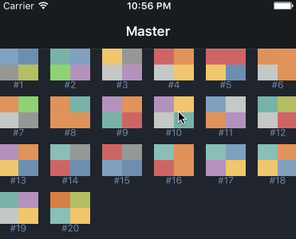

# Collection Transition

Implementation for some kind of "folder to content" animation for  `UICollectionView`. `MasterViewController` is list of some folder or whatever. On clicking on this cell we have "open animation", and push `DetailViewController` with content.

## Implementation in few words

There not used `useLayoutToLayoutNavigationTransitions` cause in this case you just change layout for `UICollectionViewController`. And you need some kind of `dirty hack` for changing content for this cells. And you still can't use different kind of `UICollectionCell` for master and detail view controllers.

So I make this behaviour by implementing usual `UIViewControllerAnimatedTransitioning` object and different start `UICollectionViewFlowLayout` for `DetailViewController`.  On the first call of `layoutAttributesForElementsInRect` we just return `attributes`, that make our `detail` cells same as components of `master` cell content. And in some point in `animateTransition(transitionContext: _)` make this layout `invalidate` or replace with another.

## Requirements 

- Swift 2.2

## License

CollectionTransition is available under the MIT license. See the LICENSE file for more info.

